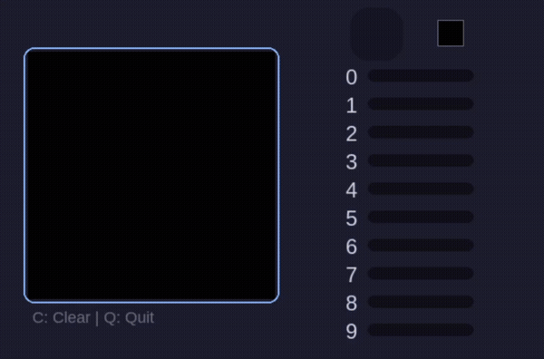

# MLP from Scratch with MNIST

A Multi-Layer Perceptron implemented from scratch in Python using **CuPy** for GPU acceleration. Built as a learning project. No other libraries , just math and CUDA.

Includes a real-time digit recognition GUI where you draw a digit and the model predicts it live.

---

## Features

- Custom MLP with fully configurable architecture
- GPU-accelerated with CuPy (CUDA)
- Activations: `ReLU`, `Sigmoid`, `Softmax`, `Linear`
- Loss functions: `Cross-Entropy`, `MSE`
- Optimizers: `SGD`, `Adam`
- He weight initialization
- Mini-batch training with shuffling
- Model save/load (`.npz`)
- Real-time drawing GUI with per-class probability bars (Pygame)

---

## Project Structure

```
├── src/
│   ├── models/
│   │   └── mlp.py          # MLP and Layer classes
│   ├── utils.py            # Activations, losses, optimizers
│   └── preprocessing.py    # Normalization, one-hot encoding, reshaping
├── train.py                # Training script
├── gui.py                  # Real-time recognition app
└── pyproject.toml
```

---

## Quickstart

**Requirements:** Python 3.13+, CUDA-compatible GPU, CUDA 13.x, [`uv`](https://docs.astral.sh/uv/)

```bash
# Install dependencies (uv will use uv.lock for reproducible environment)
uv sync

# Train the model (requires MNIST as .npz)
uv run train.py --path data/mnist.npz

# Launch the GUI
uv run gui.py
```

> MNIST in `.npz` format can be obtained via `np.savez()` from `keras.datasets.mnist` or similar sources.

---

## Model Architecture (default)

```
Input (784)  →  Dense 128 ReLU  →  Dense 64 ReLU  →  Dense 10 Softmax
```

Trained with Adam (lr=0.001), batch size 128, 100 epochs. Reaches ~98% test accuracy on MNIST.

---

## GUI

Draw a digit with your mouse. The model predicts in real-time and displays per-digit probabilities.

| Control | Action |
|---------|--------|
| Left click & drag | Draw |
| `C` | Clear canvas |
| `Q` | Quit |

<div align="center">
  
</div>
---

Built mostly to understand the math behind backpropagation. Adding a CNN might be the next step, though I'm not sure if it belongs in this project yet.
